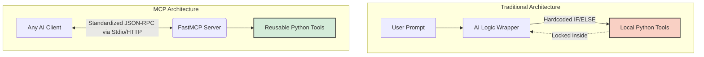

# Understanding the Model Context Protocol (MCP) Transition

Welcome to our deep dive! In this document, we will explore the critical differences between building AI Agents the "Traditional Way" (without MCP) versus the "Modern Way" (using MCP).

---

## 🏛️ The Paradigm Shift

Before we look at the code, let's understand *why* MCP was created. 

Imagine you built a brilliant Python function that calculates shipping costs.
* **Without MCP:** If you want your chatbot to use it, you have to write code specifically for your chatbot to understand the function. If your friend wants to use it in their app, they have to rewrite everything for their specific app.
* **With MCP:** You turn your function into a "USB Plug." Any AI application (Claude Desktop, Cursor IDE, customized chatbots) can just "plug into" your shipping calculator and immediately understand how to use it. No extra integration code required!

### Architectural Difference



---

## 📜 File 1: The "Without MCP" Way

*Filename Reference: `agenticv01_without_mcp.py`*

This represents the "Traditional Architecture" seen above. Everything lives in one giant, tightly-coupled script.

### Step-by-Step Code Breakdown:

#### 1. Setup & Functions (The Core Logic)
```python
client = OpenAI(...)

def get_time(location):
    return f"The time in {location} is 5:00 PM"
```
Here, we connect to an AI (like a local Ollama model) and define two pure Python functions. This part is simple.

#### 2. The JSON Schema Nightmare
```python
tools = [{ "type": "function", "function": { "name": "get_time", "description": "Get current time", "parameters": { ... } } }]
```
Because the AI doesn't inherently understand Python code, we are forced to translate our Python function into a massive JSON object. For just two tools, this took almost 30 lines of code! In a production app with 50 tools, this becomes entirely unmanageable.

#### 3. The Brittle Routing Logic
```python
if name == "get_time":
    result = get_time(params.get("location"))
elif name == "calculate":
...
```
When the AI decides it wants to use a tool, it passes us back the name of the tool as a string. We have to manually write `if...elif...else` blocks to route the execution. What happens if you rename a tool? The whole script breaks. 

---

## 🚀 File 2: The "With MCP" Way 

*Filename Reference: `agenticv01_with_mcp.py`*

This represents the modern era. We build an **MCP Server** that exposes our tools to the world.

### Step-by-Step Code Breakdown:

#### 1. Server Initialization
```python
from mcp.server.fastmcp import FastMCP
mcp = FastMCP("Time & Calculator Server")
```
We initialize the `FastMCP` framework. Think of this like starting a mini web-server, but instead of serving HTML sites to humans, it serves AI Tools to Large Language Models.

#### 2. The Magic Decorators
```python
@mcp.tool()
def get_time(location: str) -> str:
    """Get current time for a specified location"""
    return f"The time in {location} is 5:00 PM"
```
**This is the most important part of the file.** 
By adding the `@mcp.tool()` decorator, the massive JSON schema from the old file is completely eliminated. `FastMCP` acts like a translator. It reads your Python parameter type (`location: str`) and your descriptive string underneath it, and it writes all the nasty JSON automatically in the background!

#### 3. Execution
```python
mcp.run()
```
That's it. Notice what is missing from this file?
1. **No API Keys or Connections:** This script doesn't connect to Ollama or OpenAI. It doesn't need to! It just hosts the tools. 
2. **No User Prompts:** We don't hardcode "What is 150 times 12?".
3. **No Routing Blocks:** The ugly `if / else` block is entirely handled by the underlying MCP protocol.

### How Does it Actually Work in Practice?

Because `agenticv01_with_mcp.py` is mostly just a server holding your tools, you must run it in the background. Once it is running, a totally separate **MCP Client** (which handles the AI LLM and the user input) attaches to the running server. The Client asks the Server: *"What tools do you have?"*. The Server replies natively in JSON. The LLM then tells the Server: *"Execute get_time for London!"*. 

This absolute separation of concerns means your tools are fundamentally modular and enterprise-ready.


import json
from openai import OpenAI

# 1. Setup the connection to AI (Local Ollama)
client = OpenAI(base_url="http://localhost:11434/v1", api_key="ollama")

# 2. DEFINING TOOLS DIRECTLY IN THE SCRIPT (Tightly Coupled)
def get_time(location):
    return f"The time in {location} is 5:00 PM"

def calculate(expression):
    try:
        return str(eval(expression))
    except:
        return "Error in calculation"

# 3. MANUALLY WRITING JSON SCHEMAS for the AI to understand the tools
tools = [
    {
        "type": "function",
        "function": {
            "name": "get_time",
            "description": "Get current time",
            "parameters": {
                "type": "object",
                "properties": {"location": {"type": "string"}},
                "required": ["location"]
            }
        }
    },
    {
        "type": "function",
        "function": {
            "name": "calculate",
            "description": "Perform simple math",
            "parameters": {
                "type": "object",
                "properties": {"expression": {"type": "string"}},
                "required": ["expression"]
            }
        }
    }
]

# 4. Start the conversation
messages = [
    {"role": "system", "content": "You are a helpful assistant. Use tools when needed."},
    {"role": "user", "content": "What is 150 times 12?"}
]

# 5. Ask the AI what to do
response = client.chat.completions.create(model="llama3.2:1b", messages=messages, tools=tools)
assistant_message = response.choices[0].message

# 6. MANUALLY ROUTING TOOL CALLS
if assistant_message.tool_calls:
    for tool_call in assistant_message.tool_calls:
        name = tool_call.function.name
        args = json.loads(tool_call.function.arguments)
        params = args.get("parameters", args)
        
        # We have to hardcode "if get_time" and "if calculate"!
        if name == "get_time":
            result = get_time(params.get("location", "London"))
        elif name == "calculate":
            result = calculate(params.get("expression", "0"))
        else:
            result = f"Error: Unknown tool {name}"
        
        messages.append(assistant_message)
        messages.append({"role": "tool", "tool_call_id": tool_call.id, "content": result})
        
        final = client.chat.completions.create(model="llama3.2:1b", messages=messages)
        print("FINAL ANSWER:", final.choices[0].message.content)
else:
    print("FINAL ANSWER:", assistant_message.content)


# Start by installing: pip install mcp
from mcp.server.fastmcp import FastMCP

# 1. Initialize the MCP Server
# We give our server a name so clients know what collection of tools this is.
mcp = FastMCP("Time & Calculator Server")

# 2. DEFINING TOOLS WITH DECORATORS (Decoupled & Standardized)
# The @mcp.tool decorator reads the parameter types (location: str) 
# and the docstring to AUTOMATICALLY create the JSON Tool Schema.
# No more writing 20 lines of JSON manually!

@mcp.tool()
def get_time(location: str) -> str:
    """Get current time for a specified location"""
    return f"The time in {location} is 5:00 PM"


@mcp.tool()
def calculate(expression: str) -> str:
    """Perform simple math equations"""
    try:
        return str(eval(expression))
    except:
        return "Error in calculation"

# 3. Run the Server
# Instead of hardcoding an API key and parsing JSON responses ourselves, 
# we let MCP handle it. AI clients just "connect" to this server.
if __name__ == "__main__":
    print("Starting the standard MCP Tool Server...")
    mcp.run()

---

## Connecting the Waiter Analogy to `agenticv01.py`

Let's look at exactly what is happening inside your `agenticv01.py` file using the Restaurant analogy.

Your `agenticv01.py` file is currently built the **"Without MCP (Hard Way)"**. Because there is no standard MCP Server (Waiter) handling your tool requests, you are being forced to do all the work yourself!

---

### 1. The Kitchen (Lines 8-15)
```python
def get_time(location):
    return f"The time in {location} is 5:00 PM"

def calculate(expression):
    ...
```
This is your **Kitchen**. This is where the actual work happens. You wrote two tools: one to check the time, and one to do math.

### 2. Hand-Writing the Menu (Lines 18-43)
```python
tools = [
    {
        "type": "function",
        "function": {
            "name": "get_time",
            "description": "Get current time",
            "parameters": { ... }
        }
    },
    ...
]
```
Because you don't have an MCP Waiter, Ollama (the AI customer) has no idea what happens inside your Kitchen. 
So, you are forced to spend **25 lines of code** manually writing a complex JSON "Menu" just to explain to Ollama how your `get_time` and `calculate` tools work. 

### 3. Being your own Waiter (Lines 56-74)
```python
if assistant_message.tool_calls:
    for tool_call in assistant_message.tool_calls:
        name = tool_call.function.name 
        ...
        if name == "get_time":
            result = get_time(...)
        elif name == "calculate":
            result = calculate(...)
```
Ollama looked at your menu and said *"I'd like to use the calculator!"*. 
Because you don't have MCP... **You have to be the Waiter!**
You had to write a giant `if...elif` block. You literally have to check what the AI ordered (`if name == 'get_time'`), walk into the kitchen, run the function yourself, and hand the result back. 

---

## 🌟 How MCP Deletes You Being The Waiter

If we upgraded `agenticv01.py` to use MCP, we would delete almost the entire file. 

We would delete the **Hand-Written Menu** (Lines 18-43) and **Being your own Waiter** (Lines 56-74). 

Instead, we would just hire the MCP Waiter using decorators on the tools!

```python
# The "With MCP" Version of agenticv01.py 
from mcp.server.fastmcp import FastMCP

mcp = FastMCP("Agentic Server")

# The Waiter reads this tag and handles writing the Menu and fetching the tools for the AI!
@mcp.tool()
def get_time(location: str) -> str:
    """Get current time"""
    return f"The time in {location} is 5:00 PM"

@mcp.tool()
def calculate(expression: str) -> str:
    """Perform simple math"""
    return str(eval(expression))

if __name__ == "__main__":
    mcp.run() # Turn on the Server!
```

### The Difference:
In `agenticv01.py` you wrote 80 lines of code because you had to handle the AI connection, write the JSON Menu, and route the tool connections yourself.

In the **MCP version**, you write 15 lines of code. The MCP Server takes care of generating the Menu and feeding it to any AI client that connects!
